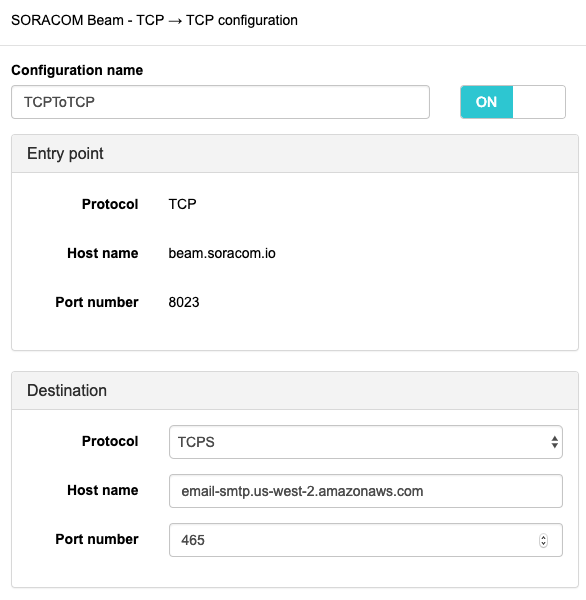

Email delivery with Amazon SES and SORACOM Beam
===============================================

Overview
--------
[SORACOM Beam](https://www.soracom.io/products/beam/) is proxy for IoT devices, It can make reduce data and power needs related to encryption.
SORACOM Beam provides some protocol conversions, In this document shows an example of TCP to TLS conversion.

This document shows TCP to TLS conversion usecase in mail delivery senario.

Send email by Amazon SES and SORACOM Beam
-----------------------------------------

[SORACOM Air] <==TCP==> [tcp://beam.soracom.io:8023] <==TLS==> [tcp://email-smtp.us-west-2.amazonaws.com:465] <==> [Recipient MTA]

1. Domain verification or User verification on Amazon SES
2. Issue SMTP auth info on IAM
3. Setting SORACOM Beam
4. Send email via SORACOM Beam


Domain verification
-------------------
https://docs.aws.amazon.com/ses/latest/DeveloperGuide/verify-domains.html

Terraform resources does not contains DNS resource records, should configure in your way.

Setting SORACOM Beam
--------------------
https://dev.soracom.io/en/beam/send-data-using-beam/



Issue SMTP auth info
--------------------
https://docs.aws.amazon.com/ses/latest/DeveloperGuide/smtp-credentials.html

Send email via SORACOM Beam
---------------------------

```
$ telnet beam.soracom.io 8023
EHLO example.com // your verified domain
AUTH LOGIN
Base64EncodedUserID // your encoded smtp username
Base64EncodedSMTPPassword // your encoded smtp password
MAIL FROM: sender@example.com // your verified sender
RCPT TO: test@example.com // recipient
DATA
From: Test Sender <sender@example.com> // your verified sender
To: test@example.com // recipient
Subject: Amazon SES SMTP and SORACOM Beam Test

This message was sent using the Amazon SES SMTP interface.
.
QUIT
```